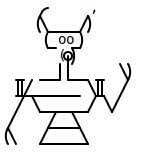

<h1 align="center">
   
  
   
  Edu Discord Bot
   
</h1>

<h4 align="center">Music, Moderation, Trivia, Stream Alerts and Fully Modular.</h4>

  
  
  
  
  

  
  
  
  

  

  <a href="#overview">Overview</a>
  •
  <a href="#installation">Installation</a>
  •
  <a href="http://edu-discordbot.readthedocs.io/en/stable/index.html">Documentation</a>
  •
  <a href="#plugins">Plugins</a>
  •
  <a href="#join-the-community">Community</a>
  •
  <a href="#license">License</a>

# Overview

Edu is derived from the [Edu-DiscordBot](https://github.com/Cog-Creators/Edu-DiscordBot) by @Cog-Creators.

[Installation](#installation) is easy, and you do **NOT** need to know anything about coding! Aside
from installing and updating, every part of the bot can be controlled from within Discord.

**The default set of modules includes and is not limited to:**

- Moderation features (kick/ban/softban/hackban, mod-log, filter, chat cleanup)
- Trivia (lists are included and can be easily added)
- Music features (YouTube, SoundCloud, local files, playlists, queues)
- Stream alerts (Twitch, Youtube, Picarto)
- Bank (slot machine, user credits)
- Custom commands
- Imgur/gif search
- Admin automation (self-role assignment, cross-server announcements, mod-mail reports)
- Customizable command permissions

**Additionally, other [plugins](#plugins) (cogs) can be easily found and added from our growing
community of cog repositories.**

# Installation

**The following platforms are officially supported:**

- [Windows](https://edu-discordbot.readthedocs.io/en/stable/install_windows.html)
- [MacOS](https://edu-discordbot.readthedocs.io/en/stable/install_linux_mac.html)
- [Most major linux distributions](https://edu-discordbot.readthedocs.io/en/stable/install_linux_mac.html)

If after reading the guide you are still experiencing issues, feel free to join the [Mav Jav Discord server](https://discord.gg/KzzTBbr) or the [Official Edu-DiscordBot Discord Server](https://discord.gg/red) and ask in the **#support** channel for help.

# Plugins

Edu is fully modular, allowing you to load and unload plugins of your choice, and install 3rd party
plugins directly from Discord! A few examples are:

- Cleverbot integration (talk to Edu and she talks back)
- Ban sync
- Welcome messages
- Casino
- Reaction roles
- Slow Mode
- AniList
- And much, much more!

Feel free to take a [peek](https://index.discord.red) at a list of
available 3rd party cogs!

# Join the community!

**Edu** is in continuous development, and it’s supported by an active community which produces new
content (cogs/plugins) for everyone to enjoy. New features are constantly added. If you can’t
[find](https://cogboard.edu/t/approved-repositories/210) the cog you’re looking for,
consult our [guide](https://edu-discordbot.readthedocs.io/en/stable/guide_cog_creation.html) on
building your own cogs!

Join the [Mav Jav Discord server](https://discord.gg/KzzTBbr) or the [Official Edu-DiscordBot Discord Server](https://discord.gg/red)!

# License

Released under the [GNU GPL v3](https://www.gnu.org/licenses/gpl-3.0.en.html) license.

Artwork created by [Mavaddat](https://mavaddat.deviantart.com/) on Deviant Art for the Edu Discord
Bot Project.

This project vendors [discord.ext.menus](https://github.com/Rapptz/discord-ext-menus) package made by Danny Y. (Rapptz) which is distributed under MIT License.
A copy of this license can be found in the [discord-ext-menus.LICENSE](edubot/vendored/discord-ext-menus.LICENSE) file in the [edubot/vendored](edubot/vendored) folder of this repository.
